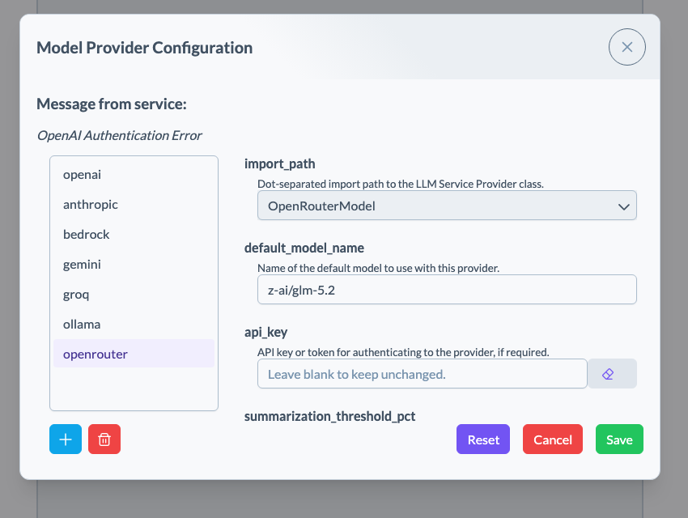

# forecasting-skills-beaker

A [Beaker notebook](https://github.com/jataware/beaker-notebook) context for weather and climate
data pipelines. Install it, start Beaker, and you get a notebook whose AI agent already knows how
to drive the [rhiza-research forecasting skills](https://github.com/rhiza-research/forecasting-skills)
— thirty-plus composable CLI tools covering data fetchers (ECMWF S2S, CHIRPS, IMERG, ERA5, CMIP6,
station networks and more), generic transforms over a shared Zarr envelope (clip, aggregate,
downscale, difference, ...), and plotters.

You describe the pipeline you want; the agent picks the skills, chains them fetch → transform →
plot, and shows you the result.

> The upstream skills are **under active development and not production ready** — see their
> [README](https://github.com/rhiza-research/forecasting-skills#readme). This context inherits
> that status.

## Get started

You'll need [`uv`](https://docs.astral.sh/uv/) and `git` on your PATH — the skills run as
uv-managed scripts from a checkout this context maintains for you.

```bash
git clone https://github.com/accord-research/forecasting-skills-beaker.git
cd forecasting-skills-beaker
uv sync
uv run beaker notebook
```

That opens `localhost:8888` on the **forecasting** context. Ask it something.

## You'll need an API key

Beaker drives a commercial LLM. Any of these work:

| Provider | Notes |
|---|---|
| **[OpenRouter](https://openrouter.ai/)** | **Recommended** — one key, most models, easy to switch |
| [Anthropic](https://console.anthropic.com/) | |
| [OpenAI](https://platform.openai.com/) | |
| [Gemini](https://aistudio.google.com/) | |

**Use a large, high-quality model.** This context asks a lot of the agent — multi-step pipelines,
CLI flag conventions, reading skill docs mid-task. Small or heavily quantized models struggle.

You don't need to configure anything up front. The first time the agent tries to reach a model it
can't authenticate to, Beaker pops up this dialog:



Pick your provider from the list on the left, set `default_model_name` to the model you want, paste
your key into `api_key`, and hit **Save**. Nothing needs restarting — your query retries from there.

(To change it later without waiting for a failure, the **gear icon** at the bottom-left opens the
same settings under `providers`.)

## Try it

```
What data sources can I fetch from, and which need credentials I don't have?

Fetch the last three weeks of CHIRPS rainfall, clip it to Kenya, and plot
the total.

Fetch the latest GFS forecast for the same region from the dynamical.org
catalog, aggregate both to daily, and plot them side by side.
```

Several fetchers need no credentials at all — CHIRPS, ARCO-ERA5, CMIP6, dynamical.org, GHCN-Daily,
OISST — so you can build a real pipeline immediately. Others need free accounts (ECMWF, NASA
Earthdata, OpenAQ, TAHMO), supplied as environment variables in the shell where you run
`uv run beaker notebook`. The Environment preview in the notebook shows which ones you have; ask
the agent and it will tell you what's missing for a given source.

## What's inside

The agent gets one [Agent Skill](https://agentskills.io/) per upstream skill, fetched from the
[forecasting-skills repo](https://github.com/rhiza-research/forecasting-skills) at session start —
so a skill improved upstream reaches your notebook on the next session with no upgrade here. It
reads a skill's full instructions only when a task needs it.

The skills themselves are standalone scripts, each with its own locked dependencies. This context
keeps a checkout of the repo under `~/.cache/forecasting-skills-beaker/` (cloned on first session,
fast-forwarded on each start) and gives the agent a `run_skill()` helper that executes them with
`uv run --script`, exactly as their docs describe. The first run of each skill resolves its
dependencies and takes a minute; after that it's fast.

The subkernel starts with `xarray as xr` and `numpy as np` imported so you (or the agent) can open
any envelope Zarr a skill produces and dig in directly.

More detail, and notes for anyone modifying this package, live in [AGENTS.md](AGENTS.md).

## Development

```bash
uv sync --extra dev
uv run pytest -m "not network"   # offline checks
uv run pytest                    # full suite, fetches live skills
```

## License

MIT
